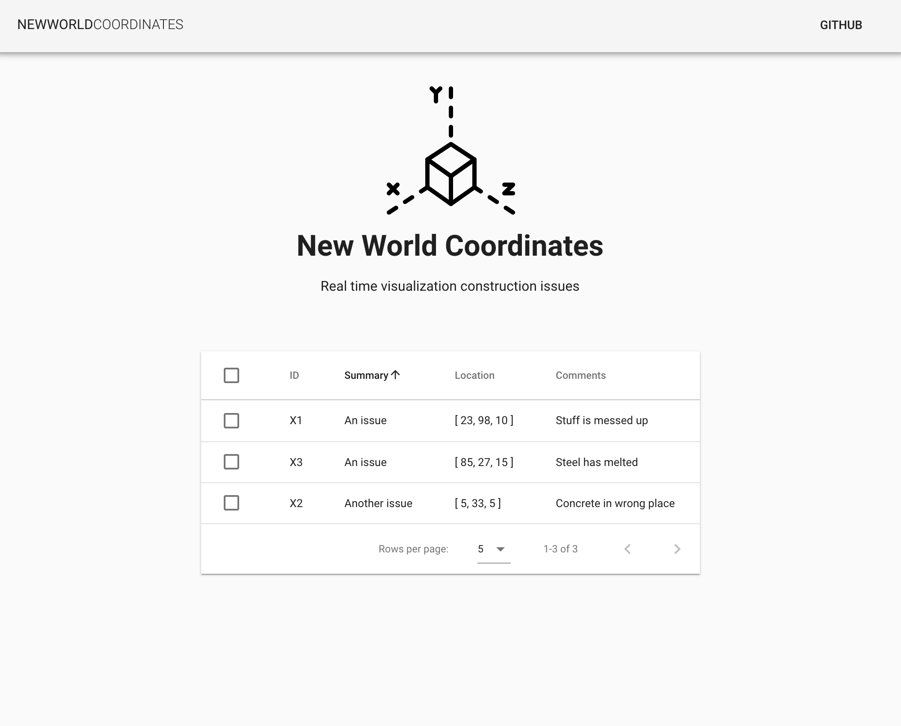

# New World Coordinates

AR/VR construction issue tracking and markup app, with a web viewer interface.

There are three repositories for this project:  
<ul>
  <li>https://github.com/MarkKinsman/NewWorldCoordinates-Unity
  <li>https://github.com/MarkKinsman/NewWorldCoordinates-API
  <li>https://github.com/MarkKinsman/NewWorldCoordinates-Web
</ul>
